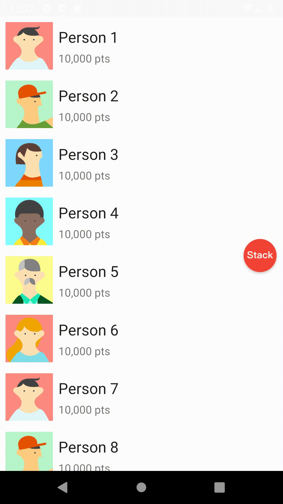

# Fragivity  :  Use Fragment like Activity

English | [中文文档](https://github.com/vitaviva/fragivity/blob/master/README_zh.md)

[](https://jitpack.io/#vitaviva/fragivity)
  


Fragivity is a library used to build APP with "Single Activity + Multi-Fragments" Architecture

- **Reasonable Lifecycle：** Lifecycle is consistent with Activity when screen changed
- **Multiple LaunchModes：** Supports multiple modes, such as Standard, SingleTop and SingleTask
- **Transition animation：** Supports Transition or SharedElement animation when switching screens
- **Efficient communication：** Simple and direct communication based on callback
- **Friendly Backpress：** Supports onBackPressed interception and SwipeBack
- **Deep Links：** Routes to the specified screen by URI
- **Dialog：** Supports DialogFragment

## Installation

JCenter is shutting down and the lib after(including) 0.2.1 can be get from JitPack.

> !Note: group name changed from `com.github.fragivity` to `com.github.vitaviva.fragivity`

### after 0.2.1

```groovy
// add in your root build.gradle at the end of repositories
allprojects {
    repositories { 
        ...
        maven { url 'https://jitpack.io' }
    }
}
```

```groovy
implementation 'com.github.vitaviva.fragivity:core:$latest_version'
```

### before 0.2.0

```groovy
implementation 'com.github.fragivity:core:$latest_version'
```

## Quick start

### 1. declare NavHostFragment in layout

Like `Navigation`, Fragivity needs a `NavHostFragment` as the host of ChildFragments

```xml
<FrameLayout xmlns:android="http://schemas.android.com/apk/res/android"
    android:id="@+id/container"
    android:layout_width="match_parent"
    android:layout_height="match_parent"
    xmlns:app="http://schemas.android.com/apk/res-auto"
    android:fitsSystemWindows="true">

    <androidx.fragment.app.FragmentContainerView
        android:id="@+id/nav_host"
        android:name="androidx.navigation.fragment.NavHostFragment"
        android:layout_width="match_parent"
        android:layout_height="match_parent"
        app:defaultNavHost="true" />
</FrameLayout>
```

### 2. load HomeFragment in Activity

```kotlin
class MainActivity : AppCompatActivity() {

    override fun onCreate(savedInstanceState: Bundle?) {
        proxyFragmentFactory()
        // with java
        // Fragivity.proxyFragmentFactory(this)

        super.onCreate(savedInstanceState)
        setContentView(R.layout.activity_main)

        val navHostFragment = supportFragmentManager
            .findFragmentById(R.id.nav_host) as NavHostFragment

        navHostFragment.loadRoot(HomeFragment::class)
        
        //or loadRoot with factory
        //navHostFragment.loadRoot{ HomeFragment() }

    }
}
```

> !Note: Add `proxyFragmentFactory()` to ensure that the fragments can run to `onStart/onStop`，before `super.onCreate()`

### 3. navigate to destination Fragment

```kotlin
//in HomeFragment
navigator.push(DestinationFragment::class) {
    arguments = bundleOf(KEY_ARGUMENT1 to "arg1", KEY_ARGUMENT2 to "arg2")
    //or 
    applyArguments(KEY_ARGUMENT1 to "arg1", KEY_ARGUMENT2 to "arg2")
}
```

## Launch Mode

Support multiple launch modes

```kotlin
navigator.push(DestinationFragment::class) {
    launchMode = LaunchMode.STANDARD //default
    //or LaunchMode.SINGLE_TOP, LaunchMode.SINGLE_TASK
}
```

## Transition Animation

```kotlin
navigator.push(DestinationFragment::class) {
    //animator
    enterAnim = R.anim.slide_in
    exitAnim = R.anim.slide_out
    popEnterAnim = R.anim.slide_in_pop
    popExitAnim = R.anim.slide_out_pop
    
    //sharedElements
    sharedElements = sharedElementsOf(imageView to "id")
}
```



## Communication

You can simply setup communication between two fragments

### 1. start destination Fragment with a callback

```kotlin
class HomeFragment : Fragment() {
    private val cb: (Int) -> Unit = { checked ->
        //...
    }

    //...

    fun startDestination() {
        navigator.push {
            DestinationFragment(cb)
        }
    }
  
    //...
}
```

### 2. callback to source Fragment

```kotlin
class DestinationFragment(val cb: (Int) -> Unit) : Fragment() {
    //...
    cb.invoke(xxx)
    //...
}

```

## Show Dialog

### 1. declare a DialogFragment

```kotlin
class DialogFragment : DialogFragment() {

    override fun onCreateView(
        inflater: LayoutInflater,
        container: ViewGroup?,
        savedInstanceState: Bundle?
    ): View? {
        val root = inflater.inflate(R.layout.fragment_dialog, container, false)
        return root
    }
}
```

### 2. show it

```kotlin
navigator.showDialog(DialogFragment::class)
```

## Deep links

### 1. add kapt dependencies

 ```groovy
kapt 'com.github.fragivity:processor:$latest_version'
```

### 2. declare URI with `@Deeplink` annotation

```kotlin
@DeepLink(uri = "myapp://fragitiy.github.com/")
class DeepLinkFragment : Fragment() {
    //...
}
```

### 3. handle intent in MainActivity

```kotlin
class MainActivity : AppCompatActivity() {

    override fun onCreate(savedInstanceState: Bundle?) {
        super.onCreate(savedInstanceState)
        setContentView(R.layout.activity_main)
        
        //...
        
        navHostFragment.handleDeepLink(intent)

    }
}
```

### 4. start Activity with URI

```kotlin
val intent = Intent(Intent.ACTION_VIEW, Uri.parse("myapp://fragitiy.github.com/"))
startActivity(intent)
```

## Router

### 1.composable Fragment in Activity

```kotlin
with(navHostFragment) {
    composable("feed") { FeedFragment.newInstance() }
    composable("search?keyword={keyword}", stringArgument("keyword")) {
        SearchFragment.newInstance()
    }
}
```

### 2.navigate to destination Fragment

```kotlin
navigator.push("search?keyword=$value")
// or
navigator.push("search") {
    arguments = bundleOf("keyword" to value.toString())
}

navigator.popTo("search")
```

## Using in Java

Fragivity provides a set of [APIs for Java developers](https://github.com/vitaviva/fragivity/blob/master/USE_JAVA.md)

## FAQ

[Frequently Asked Question](https://github.com/vitaviva/fragivity/blob/master/FAQ.md)

## License

Fragivity is licensed under the [MIT License](LICENSE).
